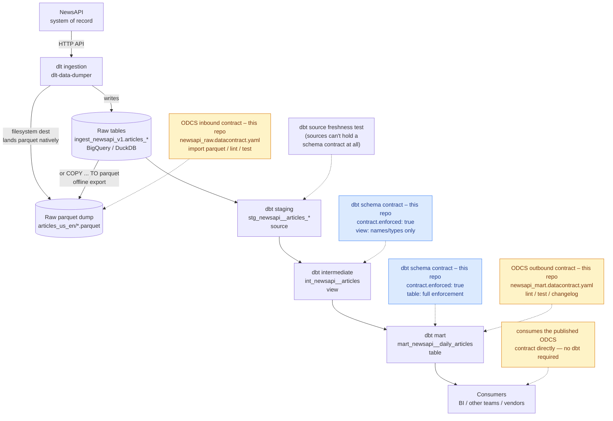

# Data Contracts Guide for dbt-bigquery-core

This guide covers "data contracts" in two senses that show up in this project,
and how they work together:

1. **dbt's native model contracts** — often called **schema contracts**,
   because the whole thing is declared inside a model's `schema.yml`
   properties file. A build-time guarantee, enforced by dbt itself, that a
   model's output matches a declared column/type shape.
2. **External data contracts with [`datacontract-cli`](https://github.com/datacontract/datacontract-cli)** —
   a published, vendor-neutral agreement (using the Open Data Contract
   Standard, ODCS) that captures ownership, SLAs, and quality rules for
   consumers who aren't running this dbt project at all.

These are two genuinely different tools with overlapping names, not two
flavors of the same thing — see [Schema Contracts vs.
datacontract-cli](#schema-contracts-vs-datacontract-cli-the-precise-difference)
for the full breakdown. Both are already wired up in this repo:
`mart_newsapi__daily_articles` and `int_newsapi__articles` enforce dbt schema
contracts, and there are two real, linted ODCS contracts —
`data_contracts/newsapi_raw.datacontract.yaml` guarding the **inbound** raw
NewsAPI feed and `data_contracts/newsapi_mart.datacontract.yaml` guarding the
**outbound** mart — so the pipeline is contracted at both ends. The guide
walks the whole arc, in the order data actually flows: from a raw parquet
dump on the way in ([Part 2a](#part-2a-inbound-contracts-on-raw-parquet-dumps)),
through the dbt models in the middle ([Part 1](#part-1-dbt-native-model-contracts)),
to the published mart on the way out ([Part 2](#part-2-external-contracts-with-datacontract-cli)).

## Table of Contents
1. [End-to-End Flow](#end-to-end-flow)
2. [Why Two Layers of "Contract"?](#why-two-layers-of-contract)
3. [Schema Contracts vs. datacontract-cli: the precise difference](#schema-contracts-vs-datacontract-cli-the-precise-difference)
4. [Part 1: dbt Native Model Contracts](#part-1-dbt-native-model-contracts)
5. [Part 2a: Inbound Contracts on Raw Parquet Dumps](#part-2a-inbound-contracts-on-raw-parquet-dumps)
6. [Part 2b: Contracting the System of Record Directly (via API, no data platform)](#part-2b-contracting-the-system-of-record-directly-via-api-no-data-platform)
7. [Part 2: External Contracts with datacontract-cli](#part-2-external-contracts-with-datacontract-cli)
8. [Part 3: Putting It Together](#part-3-putting-it-together)
9. [Troubleshooting](#troubleshooting)

## End-to-End Flow

Both contract layers sit at different points in the same pipeline — from
the NewsAPI system of record, through ingestion and dbt, to whoever
consumes the mart. Solid boxes are the pipeline; dashed boxes are the
contract checkpoints at each stage, color-coded blue for a dbt schema
contract and amber for an ODCS contract. **All four contract boxes marked
"this repo" exist today** — the two dbt schema contracts, the inbound ODCS
contract on a raw parquet dump, and the mart's outbound ODCS contract.



Reading it stage by stage:

- **NewsAPI → raw tables / raw parquet dump**: the inbound ODCS contract
  (`newsapi_raw.datacontract.yaml`) lives here. dlt can land the vendor feed
  as tables (BigQuery/DuckDB) *or* as parquet files natively via its
  `filesystem` destination — either way datacontract-cli gets parquet it can
  lint and live-test — see
  [Part 2a](#part-2a-inbound-contracts-on-raw-parquet-dumps). NewsAPI itself
  never needs to know the contract exists.
- **dbt staging (`stg_newsapi__articles_*`)**: this is a dbt **source**, and
  dbt model contracts explicitly do not apply to sources, seeds, or
  snapshots (see [Supported materializations](#supported-materializations)).
  The only checkpoint here is the existing `freshness:` test on the source —
  which is why an inbound ODCS contract is the more natural fit for
  filling this specific gap, not a dbt contract.
- **dbt intermediate → mart**: this is where dbt's native schema contracts
  actually live in this repo, and where the materialization difference
  matters — `view` (names/types only) vs. `table` (full enforcement,
  covered in [Hands-on](#hands-on-enabling-breaking-and-fixing-a-contract)).
- **Mart → consumers**: the mart is the one place both layers stack —
  dbt's contract guards the build, and the ODCS contract in
  `data_contracts/newsapi_mart.datacontract.yaml` is the artifact a BI tool
  or another team can point at without ever running this dbt project.

## Why Two Layers of "Contract"?

Look at `models/staging/newsapi/raw/_newsapi__sources.yml`:

```yaml
meta:
  owner: "data_engineering_team"
  source_system: "NewsAPI"
  data_contract:
    version: "1.0"
    owner: "external_vendor"
```

This `meta.data_contract` block sat for a long time as plain metadata — dbt
doesn't read it, nothing enforced it, and nothing tested against it. It was
an implicit acknowledgment that "this vendor data comes with an agreement,"
but the agreement was never made real. It **is** real now:
`data_contracts/newsapi_raw.datacontract.yaml` is that agreement written as
an ODCS contract (owner `external_vendor`, matching the block above),
lintable and live-testable against a raw parquet dump — see
[Part 2a](#part-2a-inbound-contracts-on-raw-parquet-dumps). Making an
agreement real means picking the right one of the two contract layers below
for the job — see the [full
comparison](#schema-contracts-vs-datacontract-cli-the-precise-difference)
if the names alone aren't enough to tell them apart. A dbt contract was the
wrong tool for this particular gap, because the raw feed arrives as a dbt
**source**, and sources can't carry a dbt schema contract at all.

dbt contracts protect the *internal* pipeline: if `int_newsapi__articles`
changes shape, `mart_newsapi__daily_articles` fails to build before bad data
ships. The external contract protects everyone *outside* the pipeline who
doesn't run `dbt build` at all — a BI dashboard, another team's warehouse, or
the "external_vendor" in that `meta` block.

## Schema Contracts vs. datacontract-cli: the precise difference

It's easy to hear "data contract" twice in the same conversation and assume
they're the same feature with two names. They're not — they're built by
different projects, solve different problems, and neither one substitutes
for the other. Here's the fuller comparison:

| Dimension | dbt schema contract | datacontract-cli / ODCS contract |
|---|---|---|
| **What it actually is** | A dbt config (`contract.enforced`) plus `data_type`/`constraints` on `columns:` in a model's `schema.yml` | A standalone YAML file conforming to the [Open Data Contract Standard](https://bitol-io.github.io/open-data-contract-standard/), a vendor-neutral spec maintained outside of dbt entirely |
| **Requires dbt to exist** | Yes — it's a dbt feature, meaningless without a dbt project | `lint`/`export`/`import`/`test` (against a warehouse): no, zero dbt needed. The dedicated `datacontract dbt sync`/`datacontract dbt test` bridge commands: yes — they shell out to a real `dbt` binary (see [Syncing directly into dbt](#syncing-directly-into-dbt-datacontract-dbt-sync--dbt-test)) |
| **What's validated** | Column **names, types, constraints** only — pure schema shape | Schema *and* SLAs, ownership, business purpose/usage/limitations, and arbitrary quality rules (row counts, custom SQL checks) |
| **Validated by** | dbt's own compiler, as a side effect of `dbt run`/`dbt build` | A separate CLI (`datacontract-cli`), run explicitly and independently |
| **When it runs** | Automatically, every build — you cannot build the model without satisfying it | Only when someone runs `datacontract lint`/`test`, e.g. in a CI step you choose to add. Skipping that step means the "contract" is not checked at all |
| **Failure mode** | Hard stop: `dbt build` errors and the model is never created | Soft, by default: `lint`/`test` print pass/warn/fail but don't block anything unless your pipeline is written to fail on a non-zero exit code |
| **Where it can be tested against** | Whatever dbt target you point `dbt run` at (`dev`/`prod` in this repo) | Any server declared under `servers:` in the contract file — but only where the CLI has a connector wired up. As of `datacontract-cli` 1.0.12 that's postgres/bigquery/snowflake/redshift/mysql/databricks/sqlserver/oracle/trino/athena/impala/kafka from a plain YAML file, plus `local`/`s3`/`gcs`/`azure` **files** (parquet/csv/json/delta) tested via a DuckDB engine, plus a Python-library-only `dataframe` type needing an in-memory Spark session — but not a `type: duckdb` server pointing at a persistent `.duckdb` catalog file directly. This repo works around that by exporting the mart to parquet and testing the `local_dev` server instead (see [Commands](#commands)) |
| **Versioning / breaking changes** | dbt model **versions** (`versions:` + `latest_version` in `schema.yml`) plus `dbt run --select state:modified+` in CI | The contract file's own `version:` field, diffed explicitly with `datacontract changelog v1.yaml v2.yaml` |
| **Portable outside this codebase** | No — it only means something to dbt and to other models/projects that `ref()` this one | Yes — the whole point is that a BI tool, another team, or an external vendor can be handed just this one file |
| **Export targets** | None — it's enforcement, not a publishing format | 25+: SQL DDL, JSON Schema, Avro, Great Expectations, HTML docs, dbt schema YAML, and more |
| **Cost to adopt** | Free — no new tool, just YAML you already write | A dev dependency to add (`datacontract-cli[<extra>]`, picking the extra that matches your actual server types — see [Installing it](#installing-it--as-a-real-project-dev-dependency)) |

The short version: a dbt schema contract is a **compiler check** — it's
inside the build and it's binary (build passes or it doesn't). A
datacontract-cli contract is a **published document with its own tooling** —
it's outside the build, richer in what it can describe, and only as strong
as the CI step you choose to wire up around it. Neither one automatically
implies or enforces the other: enabling `contract.enforced: true` on a model
does nothing to `data_contracts/newsapi_mart.datacontract.yaml`, and linting
that ODCS file does nothing to dbt's own build. They have to be run
separately, which is exactly why [Part 3](#part-3-putting-it-together)
chains both into one suggested CI sequence.

## Part 1: dbt Native Model Contracts

### Prerequisites

A model can only get a contract once every column it returns is declared
with an explicit `data_type` in its properties YAML. Both
`mart_newsapi__daily_articles` and `int_newsapi__articles` already had this in
place before enforcement was ever turned on — see their `columns:` blocks.

### Enabling a contract

```yaml
models:
  - name: mart_newsapi__daily_articles
    config:
      contract:
        enforced: true
    columns:
      - name: article_date
        data_type: date
      - name: article_count
        data_type: integer
```

`contract.enforced` can be set in three places: project-wide in
`dbt_project.yml` (`+contract: {enforced: true}`), per-model in the
properties YAML shown above, or per-model in a `{{ config(...) }}` block in
the SQL file. This project uses the properties-YAML form.

### Supported materializations

| Materialization | Supported | Notes |
|---|---|---|
| `table` | ✅ | Full enforcement, including constraints |
| `view` | ✅ | Names/types only — constraints are not enforced |
| `incremental` | ✅ | Requires `on_schema_change: append_new_columns` or `fail` |
| `ephemeral`, `materialized_view` | ❌ | Not supported |
| Python models | ❌ | Not supported |

`mart_newsapi__daily_articles` is a `table` (per
`dbt_project.yml`'s `mart: +materialized: table`), so its `not_null`
constraint is actually enforced in the DDL. `int_newsapi__articles` is a
`view` (`intermediate: +materialized: view`), so its contract only checks
column names and types — a real, useful distinction to keep in mind when
deciding where to put a contract.

### BigQuery vs. DuckDB constraint enforcement

| Platform | `not_null` | `primary_key` | `foreign_key` | `unique` | `check` |
|---|---|---|---|---|---|
| BigQuery (prod) | ✅ enforced | definable, not enforced | definable, not enforced | ❌ | ❌ |
| DuckDB (dev) | ✅ enforced | definable | definable | ✅ | ❌ |

This project's dev target is DuckDB and prod is BigQuery (see
`profiles.yml`), so a contract that passes locally with a `unique`
constraint won't actually block a duplicate row once deployed to BigQuery —
BigQuery only enforces `not_null` for contracted models. Keep real dedup
tests (like the existing `unique` data test) even after adding a contract.

### Hands-on: enabling, breaking, and fixing a contract

This is exactly what happened when this guide was written — not a
hypothetical.

**1. Flip the switch.** `mart_newsapi__daily_articles.yml` had
`contract: {enforced: false}` with fully typed columns already in place.
Changing it to `enforced: true` and running:

```bash
uv run dbt build --select mart_newsapi__daily_articles+ --target dev
```

immediately failed:

```
Compilation Error in model mart_newsapi__daily_articles (models/mart/newsapi/mart_newsapi__daily_articles.sql)
This model has an enforced contract that failed.
Please ensure the name, data_type, and number of columns in your contract match the columns in your model's definition.

| column_name   | definition_type | contract_type | mismatch_reason    |
| ------------- | --------------- | ------------- | ------------------ |
| article_count | BIGINT          | INTEGER       | data type mismatch |
```

**Why:** the model computes `article_count` with `COUNT(*)`, and DuckDB's
`COUNT(*)` returns `BIGINT` (64-bit), not the `INTEGER` (32-bit) declared in
the contract. This isn't a contrived example — it's the single most common
way a real contract breaks: an aggregate function's native return type
doesn't match the "obvious" type you'd write in YAML.

**2. Fix it at the source.** Instead of loosening the contract, the model SQL
was made to match the promise:

```sql
CAST(COUNT(*) AS INTEGER) AS article_count
```

`CAST(... AS INTEGER)` is also valid on BigQuery (it's a synonym for
`INT64`), so this fix holds across both dev and prod targets. Re-running the
build now passes cleanly.

**3. Same story on the intermediate model.** Adding
`config: {contract: {enforced: true}}` to `int_newsapi__articles.yml` and
rebuilding surfaced a second, equally real mismatch:

```
| column_name  | definition_type          | contract_type | mismatch_reason    |
| ------------ | ------------------------ | ------------- | ------------------ |
| published_at | TIMESTAMP WITH TIME ZONE | TIMESTAMP     | data type mismatch |
```

Here the contract itself was stale — `published_at` is passed straight
through from the dlt-loaded staging tables as a timezone-aware timestamp, and
the contract had declared the timezone-naive `timestamp`. Since preserving
the offset is the more correct behavior (and a test in the same file already
allowed for `"timestamp with time zone"` as a valid type), the contract was
corrected to `data_type: timestamp with time zone` rather than casting away
timezone information in the model.

The lesson generalizes: a contract violation is a fork in the road, not
necessarily a bug to route around by loosening the contract. Sometimes the
model is wrong (the `article_count` case); sometimes the contract's promise
was never quite right (the `published_at` case). Decide which one you're
looking at before "fixing" it.

### The `numeric` precision gotcha

dbt ignores size/precision/scale differences when comparing most types, but
not for `numeric`. `data_type: numeric` relies on platform-specific defaults
(often precision 38, scale 0 — i.e., no decimals). If you ever add a
monetary or fractional column under contract, always write the explicit
scale:

```yaml
data_type: numeric(38, 6)   # not just `numeric`
```

## Part 2a: Inbound Contracts on Raw Parquet Dumps

Part 1 contracted the *middle* of the pipeline (the dbt models). This part
contracts the very *start* of it — the raw vendor feed, before dbt touches
it — which is exactly where a "start from raw dumps of parquet/avro" flow
begins. It's the same `datacontract-cli` tool as [Part 2](#part-2-external-contracts-with-datacontract-cli),
pointed at the inbound end instead of the outbound one.

> This part uses `datacontract-cli` as a project dev dependency. If you
> haven't set that up yet, read
> [Installing it](#installing-it--as-a-real-project-dev-dependency) in Part 2
> first — every command below runs through `uv run` the same way.

### Why the raw feed is a *file* contract, not a dbt contract

Two independent reasons push the inbound checkpoint onto a file-based ODCS
contract rather than a dbt one:

1. The raw feed enters the project as a dbt **source**, and dbt schema
   contracts [don't apply to sources](#supported-materializations) at all.
2. It's genuinely reasonable to treat raw/landed data as **files** (parquet,
   csv, avro) rather than only as warehouse tables — and datacontract-cli's
   DuckDB-powered `local`/`s3`/`gcs`/`azure` file testing exists precisely
   for that shape. Landing (or exporting) the feed as parquet gives the CLI
   something it can lint *and* live-test with no warehouse at all.

### Two ways to get the raw parquet dump

There are two paths to a raw parquet file, and this repo supports both:

- **Native (dlt `filesystem` destination)** — `python newsapi_pipeline.py
  --filesystem` (wrapped as `make dump-raw-parquet`) fetches the live feed
  and writes parquet **directly**, no warehouse involved. dlt lays it out as
  `<bucket>/<dataset>/<table>/<load_id>.<file_id>.parquet` — by default
  `file:///tmp/newsapi_raw/ingest_newsapi_v1/articles_us_en/*.parquet` (one
  file per load, hence the glob). This is the truest "raw dump lands as
  parquet" shape and what the contract's `local_raw_native` server points at.
  It needs a NewsAPI key, since it fetches live.
- **Offline export (`COPY ... TO parquet`)** — if the data is already in the
  dev DuckDB (e.g. from a prior `--test` run), export one table to a single
  parquet with no API key. This is what `make data-contract-raw-test` and the
  bootstrap below use, and what the `local_raw` server points at. Handy for
  CI and for reproducing this guide without credentials.

Both produce the **same flattened schema** — dlt normalises the vendor's
nested `source` object to `source__id`/`source__name` and adds its
`_dlt_load_id`/`_dlt_id` bookkeeping columns either way — so one contract
covers both `local_raw` and `local_raw_native`.

### Bootstrapping the contract from a real dump (`import parquet`)

Don't hand-write the inbound contract — generate it from a real dump, the
same discipline the mart contract used with `import dbt`. Using the offline
export below (so no API key is needed to follow along; you could equally
point `--source` at a native `--filesystem` file — the inferred schema is
identical):

```bash
mkdir -p /tmp/datacontract_exports
uv run python3 -c "import duckdb; con=duckdb.connect('/tmp/newsapi_articles.duckdb', read_only=True); con.sql(\"COPY (SELECT * FROM ingest_newsapi_v1.articles_us_en) TO '/tmp/datacontract_exports/raw_newsapi__articles_us_en.parquet' (FORMAT PARQUET)\")"

uv run datacontract import parquet \
  --source /tmp/datacontract_exports/raw_newsapi__articles_us_en.parquet \
  --output data_contracts/newsapi_raw.datacontract.yaml
```

`import parquet` reads the parquet footer and emits a draft ODCS contract —
one property per column, types inferred from the file:

```yaml
schema:
- name: raw_newsapi__articles_us_en
  physicalType: parquet
  properties:
  - name: title
    physicalType: STRING
    logicalType: string
  - name: published_at
    physicalType: TIMESTAMP
    logicalType: timestamp
  # ...author, url, content, source__name, source__id, _dlt_load_id, _dlt_id
```

### Hand-enriching it

The draft has the schema but none of the *contract*. The committed
`data_contracts/newsapi_raw.datacontract.yaml` adds the pieces `import`
can't infer, mirroring the mart contract:

- **`team.name: external_vendor`** and `customProperties.owner:
  external_vendor` — deliberately matching the `meta.data_contract.owner`
  block in `_newsapi__sources.yml`, so the agreement that was
  ["never made real"](#why-two-layers-of-contract) now is.
- inbound `description.purpose` / `.usage` / `.limitations`.
- three `servers`: `dev` (`type: duckdb`, for parity, not directly testable),
  `local_raw` (`type: local, format: parquet`, the offline export path), and
  `local_raw_native` (`type: local, format: parquet` over the dlt filesystem
  `*.parquet` glob) — the last two are the actually-testable ones.
- `quality` checks: a `rowCount >= 1` library check, plus a `type: sql`
  check that every article carries a `published_at`. As on the mart, the SQL
  uses the **literal table name** (`FROM raw_newsapi__articles_us_en`), never
  `${table}`/`${column}` placeholders — those aren't substituted.
- `required: true` on the columns that anchor the feed (`title`, `url`,
  `published_at`).

### Lint and test

Both are wired into the Makefile next to their mart counterparts:

```bash
make data-contract-raw-lint
# uv run datacontract lint data_contracts/newsapi_raw.datacontract.yaml
#
# ╭────────┬──────────────────────────────────────┬───────┬─────────╮
# │ Result │ Check                                │ Field │ Details │
# ├────────┼──────────────────────────────────────┼───────┼─────────┤
# │ passed │ Data contract is syntactically valid │       │         │
# ╰────────┴──────────────────────────────────────┴───────┴─────────╯
# 🟢 data contract is valid. Run 1 checks. Took 0.15s.
```

`make data-contract-raw-test` re-exports the raw table to parquet and tests
the `local_raw` server against it — a real, live check on real data:

```makefile
mkdir -p /tmp/datacontract_exports
uv run python3 -c "import duckdb; con = duckdb.connect('/tmp/newsapi_articles.duckdb', read_only=True); con.sql(\"COPY (SELECT * FROM ingest_newsapi_v1.articles_us_en) TO '/tmp/datacontract_exports/raw_newsapi__articles_us_en.parquet' (FORMAT PARQUET)\")"
uv run datacontract test data_contracts/newsapi_raw.datacontract.yaml --server local_raw
```

```
│ passed │ Check that model raw_newsapi__articles_us_en has row_count >= 1 │
│ passed │ Check that field published_at has no missing values             │
│ passed │ Every landed article must carry a publish timestamp.            │
│ ... (presence + type checks for every column) ...                        │
🟢 data contract is valid. Run 27 checks. Took 1.21s.
```

Same DuckDB-backed `local` file engine the mart's `local_dev` server uses
(see [Commands](#commands)) — the only difference is which parquet file it
reads. As with the mart, `type: duckdb` (the `dev` server) can't be tested
directly; the parquet file is the working path.

To test the **natively-landed** parquet instead (no export step, closest to
a real raw dump), land it once and point at the `local_raw_native` glob:

```bash
make dump-raw-parquet              # python newsapi_pipeline.py --filesystem (needs a NewsAPI key)
make data-contract-raw-test-native # datacontract test ... --server local_raw_native
# 🟢 data contract is valid. Run 27 checks. Took 1.10s.
```

Because dlt writes one parquet file per load, `local_raw_native`'s `path`
ends in `articles_us_en/*.parquet` — datacontract-cli hands that straight to
DuckDB's `read_parquet`, which expands the glob across every load. Same 27
checks pass, on the same schema, proving the native `filesystem` output and
the offline export are interchangeable for contract testing.

### Proving the checks actually run (adversarial)

A passing run is only convincing if you've seen it fail. Invert the
`published_at` check in a throwaway copy — `IS NULL` → `IS NOT NULL`, which
should now match all 99 rows — and re-test:

```bash
cp data_contracts/newsapi_raw.datacontract.yaml /tmp/raw_adversarial.yaml
# edit /tmp/raw_adversarial.yaml: WHERE published_at IS NULL  ->  IS NOT NULL
uv run datacontract test /tmp/raw_adversarial.yaml --server local_raw; echo "exit=$?"
```

```
│ failed │ Every landed article must carry a publish timestamp. │ Actual ... │
🔴 data contract is invalid, found the following errors:
exit=1
```

The check correctly fails (non-zero exit), confirming the SQL genuinely
evaluates the exported parquet rather than passing by default.

### Avro instead of parquet

The same pattern works from an Avro **schema** on the import side —
`datacontract import avro --source feed.avsc --output ...` generates an ODCS
contract just like `import parquet` does. **The one asymmetry to know:**
`datacontract test` has no Avro file reader. Its `local`/`s3`/`gcs`/`azure`
file engine supports only `json`, `parquet`, `csv`, and `delta`
(`_SUPPORTED_FILE_FORMATS` in
`datacontract/engines/ibis/connections/connect.py`, as of
`datacontract-cli` 1.0.12) — a `format: avro` server warns and skips instead
of testing. So for avro-landed data: **import/lint from the `.avsc`
directly, but convert (or also land) the data as parquet for the live
`test` step.** If your ingestion can emit either format, parquet is the one
that gets the complete, unqualified round trip here.

## Part 2b: Contracting the System of Record Directly (via API, no data platform)

> **Status: theoretical extension, but validated end-to-end.** This is *not*
> wired into the repo's Makefile or CI. Every command and output below was run
> live against the real NewsAPI, but the artifacts live under `/tmp` — this
> section exists to answer a design question, not to add a maintained contract.

**The question:** every contract so far sits *after* something has already
landed the data — a dbt model (Part 1), or a parquet dump that dlt produced
(Part 2a). Could we instead point `datacontract-cli` at the **system of
record itself** — the NewsAPI HTTP endpoint — and contract the vendor payload
*before any platform (dlt, warehouse, dbt) touches it*, collecting the schema
metadata straight from the API?

**The answer: yes for schema + testing, but the CLI never calls the API for
you.** Two facts, both verified against `datacontract-cli` 1.0.12:

1. There is **no `api`/`http`/`rest` server type**. The connection dispatcher
   (`datacontract/engines/ibis/connections/connect.py`) only knows SQL
   warehouses (postgres/bigquery/snowflake/…), `kafka`, `dataframe`, and the
   `local`/`s3`/`gcs`/`azure` **file** servers. The
   [datacontract-cli README](https://github.com/datacontract/datacontract-cli)
   confirms it — "API" there refers to running the CLI *as* a web server, not
   to polling one as a source. So `datacontract test` cannot hit an HTTP
   endpoint directly.
2. But `import` **can** learn the schema from an API sample (`import json`),
   and `test` **can** read a fetched payload as a `type: local, format: json`
   server (JSON is in `_SUPPORTED_FILE_FORMATS`).

So the pattern is: **you** make the one API call (a few lines of `urllib`,
`curl`, or your ingestion service), persist the response as JSON, and hand
that to the CLI. No warehouse, no dbt, no dlt — a "data platform" is genuinely
absent — but a thin fetch-and-persist step is not optional, because the CLI
won't fetch for you.

### Collect the metadata: fetch a sample, import the schema

Call the endpoint and save the records exactly as the vendor returns them:

```bash
# a few lines of plain python — no pipeline framework
uv run python3 -c "
import json, urllib.request, urllib.parse
key='<NEWSAPI_KEY>'
q=urllib.parse.urlencode({'language':'en','q':'AI','pageSize':20,'apiKey':key})
r=json.load(urllib.request.urlopen('https://newsapi.org/v2/everything?'+q))
json.dump(r['articles'], open('/tmp/dc_api/newsapi_articles.json','w'))"
```

Then bootstrap a contract from **one** record (see the array gotcha below):

```bash
uv run python3 -c "import json;a=json.load(open('/tmp/dc_api/newsapi_articles.json'));json.dump(a[0],open('/tmp/dc_api/one_article.json','w'))"

uv run datacontract import json \
  --source /tmp/dc_api/one_article.json \
  --id newsapi-sor-articles --owner external_vendor \
  --output /tmp/dc_api/sor.datacontract.yaml
```

The generated schema captures the vendor's **native shape** — and this is the
key insight — *not* the shape any of the other contracts describe:

```yaml
schema:
- name: newsapi_articles
  properties:
  - name: source            # nested OBJECT, not yet flattened
    physicalType: object
    properties:
    - name: id
    - name: name
  - name: publishedAt       # camelCase, not snake_case
    physicalType: string
  - name: urlToImage        # camelCase
    physicalType: string
  # ...author, title, description, url, content
```

Compare to `newsapi_raw.datacontract.yaml` (Part 2a), which has
`published_at`, `url_to_image`, `source__id`, `source__name`, plus
`_dlt_load_id`/`_dlt_id`. Those snake_case, flattened, bookkeeping-augmented
columns are **dlt's doing**. The system-of-record contract sees none of it —
it describes the raw vendor JSON as the vendor actually emits it.

### Test the fetched payload (`type: local, format: json`)

Point the server at the full array of fetched records and test:

```yaml
servers:
- server: production
  type: local
  format: json
  path: /tmp/dc_api/newsapi_articles.json
  delimiter: array          # the file is a JSON array of records
```

```bash
uv run datacontract test /tmp/dc_api/sor.datacontract.yaml --server production
```

Real output — 9 checks pass, including a structural "valid JSON" check and a
presence check on the nested `source` object:

```
│ passed │ Check that JSON has valid schema │ ...  │ All JSON entries are valid │
│ passed │ Check that field 'publishedAt' … │ publishedAt │                     │
│ passed │ Check that field 'source' …      │ source      │                     │
│ ... (author, content, description, title, url, urlToImage) ...               │
🟢 data contract is valid. Run 9 checks. Took 1.01s.
```

That is a real contract test of the live vendor feed with **no data platform
in the loop at all** — just the API, a JSON file, and the CLI.

### Why you'd actually do this

- **Shift-left / edge validation.** You catch a vendor breaking-change the
  moment it arrives, in the vendor's *own* schema terms, upstream of dlt — a
  renamed `publishedAt` or a `source` that stops being an object fails here
  before it ever becomes a confusing downstream type error.
- **No platform dependency.** The check needs only the CLI and network access,
  so it can live inside the ingestion service, a lambda, or a cron — anywhere
  that can already call the API. Nothing to spin up.
- **It pinpoints blame.** Run together with the Part 2a raw-parquet contract,
  the pair localises any break: SoR contract red + raw contract green ⇒ the
  vendor changed; SoR green + raw red ⇒ *your* dlt normalisation changed. One
  contract can't tell you that; two at different stages can.

### Limits and honest caveats

- **The CLI does not poll the API.** "No data platform" is true; "no code" is
  not — you own the fetch-and-persist step. If that step can push to a
  supported server (a Kafka topic, a Postgres staging table, an S3 object),
  you can `test` that instead of a local file — but something still has to do
  the pushing.
- **`import json` on a bare array only captures the array wrapper** (a
  `physicalType: array` with no fields). Import from a **single object** to
  get the field tree, as above; then point the *test* server at the array.
- **No `openapi` importer** in 1.0.12 (the formats are `json`, `jsonschema`,
  `avro`, `sql`, `parquet`, `csv`, … — no OpenAPI). If your vendor publishes
  an OpenAPI spec, extract the response body's JSON Schema and use
  `import jsonschema`.
- **`type: dataframe`** is the only way to skip the on-disk file entirely
  (load the API JSON into a DataFrame and test in memory), but it's a
  Python-library-only path needing a pandas/Spark session — heavier than a
  one-line JSON dump for most cases.
- This SoR contract is a **distinct artifact** from the raw-parquet one; they
  describe different schemas on purpose and are maintained separately.

## Part 2: External Contracts with datacontract-cli

### What this adds that dbt contracts don't

dbt contracts only exist inside this dbt project and only matter at build
time. `datacontract-cli` publishes a standalone, ODCS-formatted YAML file
that:

- Declares ownership, SLAs, and business purpose/usage/limitations —
  the kind of thing currently stranded in `meta.data_contract` blocks.
- Can be tested against a live warehouse independent of whether dbt ever ran
  (`datacontract test`).
- Can be diffed for breaking changes as its own artifact
  (`datacontract changelog`), so a consumer who never touches this repo can
  still see "did the contract I depend on change?" in a PR.
- Exports to 25+ formats (SQL DDL, dbt schema YAML, JSON Schema, Avro,
  Great Expectations suites, HTML docs, and more) — useful when the mart's
  consumers use tooling completely outside this project.

### Installing it — as a real project dev dependency

An earlier version of this guide claimed `datacontract-cli` requires Python
3.10–3.12 and therefore couldn't be a dependency of this project (which
pins `requires-python = ">=3.13"`). That claim came from the docs website's
stated/recommended support matrix, not the package's actual metadata —
checking `datacontract_cli-1.0.12.dist-info/METADATA` directly shows
`Requires-Python: <3.15,>=3.10`, which does include 3.13. Installing and
running it under this project's Python 3.13 was verified end-to-end, so
it's a normal dev dependency:

```toml
[dependency-groups]
dev = [
    "pytest>=9.1.0",
    "ruff>=0.15.0,<1.0.0",
    "ipykernel>=6.29.0,<7.0.0",
    "datacontract-cli[duckdb]>=1.0.12,<2.0.0",
]
```

**One real extras gotcha, found by actually running `uv lock`:**
`datacontract-cli[all]` — the "install everything" extra — pulls in
`duckdb-extension-aws`, which pins `duckdb<=1.5.3`. This project's own
`dependencies` list requires `duckdb>=1.5.4`. Because `requires-python` here
is the open-ended `>=3.13` (no upper bound), `uv lock` tries to find one
resolution that works across *every* future Python version too, and fails
outright:

```
× No solution found when resolving dependencies for split (markers:
│ python_full_version >= '3.14' ...):
╰─▶ ... datacontract-cli[all]>=1.0.12 depends on duckdb>=1.5.0,<=1.5.3 ...
    your project and dbt-bigquery-core:dev are incompatible.
```

The fix isn't a Python-version workaround — it's picking a **narrower
extra that matches the servers you actually use**, instead of `[all]`.
This project only runs a local DuckDB target (no real BigQuery connection
in practice), so `[duckdb]` is the right, minimal choice: it pulls in
`duckdb<1.6.0,>=1.5.0` and `ibis-framework[duckdb]`, which resolves cleanly
and is exactly what powers the `local`/parquet live-testing workaround
below. If your project actually queries BigQuery/Snowflake/Postgres/etc.,
use that connector's extra instead (`[bigquery]`, `[snowflake]`, ...) — just
avoid `[all]` unless you've confirmed it resolves against your own pinned
versions.

Because it's a normal dev dependency now, every command in this guide runs
through the project's own venv — `uv run datacontract ...` — the same way
`uv run dbt ...` already does. No standalone install, no `PATH` shell-profile
edits, no `uv tool run --from ...` indirection.

### The contract file

`data_contracts/newsapi_mart.datacontract.yaml` was generated from the
project's own build artifacts, not typed by hand from scratch:

```bash
uv run dbt build --target dev   # produces target/manifest.json
uv run datacontract import dbt \
  --source dbt-bigquery-core/target/manifest.json \
  --model mart_newsapi__daily_articles \
  --owner data_team_name \
  --id newsapi-daily-articles \
  --output data_contracts/newsapi_mart.datacontract.yaml
```

That import gives you the schema (columns, types, `required`/`unique`
flags) straight from a real, contract-passing dbt build. From there, the
file was hand-enriched with the pieces `import dbt` can't infer:

- `servers` for `dev` (duckdb), `prod` (bigquery, matching `profiles.yml`
  even though this project doesn't run it in practice), and `local_dev`
  (a parquet snapshot — see [Commands](#commands) for why)
- `description.purpose` / `.usage` / `.limitations`
- `slaProperties` (daily frequency, matching the model's existing
  `meta.sla: "daily"`)
- `quality` checks mirroring the existing `dbt_expectations` tests (row
  count ≥ 1, `article_count` between 1 and 10000)

### Commands

**Lint** — validate the YAML against the ODCS schema:

```bash
make data-contract-lint
# uv run datacontract lint data_contracts/newsapi_mart.datacontract.yaml
#
# ╭────────┬──────────────────────────────────────┬───────┬─────────╮
# │ Result │ Check                                │ Field │ Details │
# ├────────┼──────────────────────────────────────┼───────┼─────────┤
# │ passed │ Data contract is syntactically valid │       │         │
# ╰────────┴──────────────────────────────────────┴───────┴─────────╯
# 🟢 data contract is valid. Run 1 checks. Took 0.13s.
```

**Export back to dbt** — round-trip the contract into dbt schema YAML, as a
sanity check that the two representations agree:

```bash
uv run datacontract export dbt-models \
  data_contracts/newsapi_mart.datacontract.yaml
```

```yaml
version: 2
models:
- name: mart_newsapi__daily_articles
  config:
    meta:
      data_contract: newsapi-daily-articles
      owner: data_team_name
    materialized: table
    contract:
      enforced: true
  columns:
  - name: article_date
    data_type: DATE
    constraints:
    - type: not_null
    - type: unique
  - name: article_count
    data_type: NUMBER
    constraints:
    - type: not_null
```

Notice `article_count` came back as `NUMBER`, not `integer` — the exporter
targets a generic SQL type set, not this exact dbt/DuckDB pairing. **Don't
paste export output directly over a hand-tuned dbt contract without
reviewing the types** — treat this export as a starting point or a
consistency check, not an authoritative source.

**Test against a live server:**

```bash
uv run datacontract test data_contracts/newsapi_mart.datacontract.yaml --server dev
```

Running this against the `dev` server (`type: duckdb`, a persistent
`.duckdb` catalog file) produces a warning, not a real test:

```
╭─────────┬──────────────────────┬──────────────────────┬──────────────────────╮
│ Result  │ Check                │ Field                │ Details              │
│ warning │ Check that server    │                      │ Server type duckdb   │
│         │ type is supported    │                      │ not yet supported by │
│         │                      │                      │ datacontract CLI     │
╰─────────┴──────────────────────┴──────────────────────┴──────────────────────╯
🟠 data contract has warnings.
```

Reading the CLI's own connection dispatcher
(`datacontract/engines/ibis/connections/connect.py` in the installed
package) confirms exactly why: it has branches for `postgres`, `bigquery`,
`snowflake`, `redshift`, `mysql`, `databricks`, `sqlserver`, `oracle`,
`trino`, `athena`, `impala`, `kafka`, and `local`/`s3`/`gcs`/`azure` **file**
servers (parquet/csv/json/delta) — but no branch for `server_type ==
"duckdb"` at all, as of `datacontract-cli` 1.0.12. Reading further into
`get_duckdb_connection` confirms the file-server path never attaches an
existing `.duckdb` file either — it only opens an in-memory DuckDB and
creates views over external parquet/csv/json/delta files. There's simply no
code path today for testing a live `type: duckdb` catalog directly.

That's not a dead end, though — it's exactly what the `local` server type
is for. It's reasonable to treat your raw/landed data as living in files
(parquet or Avro, say) rather than only as tables inside a database
catalog, and datacontract-cli's DuckDB-powered `local`/`s3`/`gcs`/`azure`
testing exists precisely for that shape of data. This project's mart
happens to live inside a `.duckdb` catalog file rather than as a landed
parquet file, so the practical move is to export the table once and test
that:

```bash
make data-contract-test
```

which runs, end-to-end and for real:

```makefile
mkdir -p /tmp/datacontract_exports
uv run python3 -c "import duckdb; con = duckdb.connect('/tmp/newsapi_articles.duckdb', read_only=True); con.sql(\"COPY (SELECT * FROM ingest_newsapi_v1.mart_newsapi__daily_articles) TO '/tmp/datacontract_exports/mart_newsapi__daily_articles.parquet' (FORMAT PARQUET)\")"
uv run datacontract test data_contracts/newsapi_mart.datacontract.yaml --server local_dev
```

against the `local_dev` server already declared in
`data_contracts/newsapi_mart.datacontract.yaml`:

```yaml
- server: local_dev
  type: local
  format: parquet
  path: /tmp/datacontract_exports/mart_newsapi__daily_articles.parquet
```

and produces a real, passing result — all 9 checks, including the custom
SQL quality check:

```
🟢 data contract is valid. Run 9 checks. Took 1.09s.
```

This isn't just declaring success — it was adversarially checked by
temporarily lowering the `article_count` quality check's upper bound to 10
(both real rows are well above that) and re-running: the check correctly
failed with `Actual custom_sql(article_count) was 2, expected = 0`, proving
the query genuinely evaluates the exported data rather than passing by
default.

If your project does run a real BigQuery/Snowflake/Postgres/etc. target,
`--server prod` (or whichever you declare) works directly with no export
step — this project's `prod` server is declared in the contract for
completeness, matching `profiles.yml`, but isn't exercised in practice here
since only the local DuckDB target is actually used. Check the
[datacontract-cli releases](https://github.com/datacontract/datacontract-cli/releases)
for a native `type: duckdb` connector before assuming the export step is
still necessary — the file-testing infrastructure it would reuse already
exists in the codebase.

**Changelog** — diff two versions of a contract to catch breaking changes
before they ship, independent of a dbt run. In CI, `v1` is typically the
base-branch copy of the file (e.g. `git show main:data_contracts/newsapi_mart.datacontract.yaml > /tmp/v1.yaml`)
and `v2` is the working copy on the PR branch:

```bash
uv run datacontract changelog \
  /tmp/v1.yaml \
  data_contracts/newsapi_mart.datacontract.yaml
```

Removing `article_count` from a copy of this repo's own contract produces
this real output:

```
Summary
[ 1 Updated ]  [ 1 Removed ]
╭─────────┬────────────────────────────────────────────────────────────╮
│ Change  │ Field                                                      │
├─────────┼────────────────────────────────────────────────────────────┤
│ Removed │ schema.mart_newsapi__daily_articles.properties.article_count│
│ Updated │ version                                                     │
╰─────────┴────────────────────────────────────────────────────────────╯
```

This is the same class of protection dbt gives you with
`--select state:modified+` breaking-change detection — except it works for
consumers who never run this dbt project at all.

### Syncing directly into dbt: `datacontract dbt sync` / `dbt test`

Separately from `export dbt-models` (which prints a standalone YAML you
review and merge by hand), `datacontract-cli` also ships a bridge that
**writes directly into a dbt project**:

```bash
uv run datacontract dbt sync \
  data_contracts/newsapi_mart.datacontract.yaml \
  --project-dir dbt-bigquery-core --target dev
```

This modifies `models/**/*.yml` in place — it merges the contract's
`quality` checks into the model's existing `data_tests:`, tags each one with
a `config.meta.datacontract_cli` block (contract id, version, whether the
CLI generated it or it already existed), and writes any check that isn't a
plain `not_null`/`unique`/`accepted_values` out as a new singular SQL test
file under `tests/datacontract_cli/<contract-id>/`. **Treat this as a
codegen step to review and commit deliberately, not something to run
unattended in CI** — it rewrites files you already hand-maintain.

Five real issues turned up while validating this against a scratch copy of
this exact repo (not a clean/toy project) — all worth knowing before you run
it here:

1. **It conflicts with this project's existing `meta:` blocks.** Every model
   in this repo already has a top-level `meta:` key (owner, SLA, business
   terms — see `mart_newsapi__daily_articles.yml`). `dbt sync` adds its own
   tracking info as `config.meta.datacontract_cli`, and dbt refuses to parse
   a model that has **both** a top-level `meta:` and a `config.meta:`:
   `found meta dictionary in 'config' dictionary and as top-level key`. This
   breaks `dbt parse` for the *entire project*, not just the synced model,
   until you fix it. The fix is to merge them — move the top-level `meta:`
   contents under `config.meta:` (or move the CLI's `datacontract_cli` key
   up into the existing top-level `meta:` block) so there's exactly one
   `meta:` per model.

2. **SQL quality checks must use literal object/column names, never
   `${table}`/`${column}` placeholders.** The ODCS spec's own docs
   ([quality-rules/sql](https://docs.datacontract.com/quality-rules/sql))
   show queries like `SELECT ... FROM orders` — no template variables. This
   repo's contract originally used
   `SELECT COUNT(*) FROM ${table} WHERE ${column} < 1 OR ${column} > 10000`,
   copying a placeholder style seen elsewhere in the CLI's own `--help`
   text. `dbt sync` does **not** substitute `${table}`/`${column}` — it
   pastes the string through verbatim into the generated singular test,
   which then fails to even compile: `Parser Error: syntax error at or near
   "$"`. This has already been fixed in
   `data_contracts/newsapi_mart.datacontract.yaml` to use the literal name
   (`FROM mart_newsapi__daily_articles WHERE article_count < 1 OR ...`).

3. **The generated SQL test references the table unqualified — not through
   `{{ ref(...) }}` — so it depends on the target's default schema search
   path.** Even after fixing issue 2, running the bridge end-to-end
   (`dbt sync` then `dbt test`, or `sync --run-tests`) still failed here
   with `Catalog Error: Table with name mart_newsapi__daily_articles does
   not exist! Did you mean "ingest_newsapi_v1.mart_newsapi__daily_articles"`.
   The literal name in the ODCS query has no way to know this project's dev
   schema is `ingest_newsapi_v1` (or that prod's is `dev_ekoepplin`) — there
   is no per-server templating for schema-qualification in a `type: sql`
   check. For a single-schema project this "just works"; for a project like
   this one that runs the same model against differently-schemad `dev` and
   `prod` targets, a literal-name SQL quality check is not portable across
   environments. Know this going in — don't assume a `dbt sync`-generated
   SQL check that passes in one environment will pass in another.

4. **`dbt sync --run-tests` and `dbt test` shell out to a real `dbt`
   binary, which must be on `PATH`.** Now that `datacontract-cli` lives in
   the same project venv as `dbt` (see
   [Installing it](#installing-it--as-a-real-project-dev-dependency)), this
   is mostly moot — but only if you invoke it the same way you'd invoke
   `dbt` itself. `uv run datacontract dbt test ...` works, because `uv run`
   puts the venv's `bin/` on `PATH` for the subprocess. Calling the
   installed binary's absolute path directly —
   `.venv/bin/datacontract dbt test ...` — does **not**, and fails with
   `Error: dbt not found on PATH`, since only activation (or `uv run`)
   modifies `PATH`, not merely having both binaries sit in the same
   directory. Always go through `uv run` (or an activated shell), not a
   direct path, for `dbt sync --run-tests` / `dbt test`.

5. **Auto-discovery (running `dbt sync` with no contract argument) requires
   the file to both match `*.odcs.yaml` *and* live inside `--project-dir`.**
   Neither is true here: this project's contract is
   `data_contracts/newsapi_mart.datacontract.yaml`, named with the CLI's own
   `init` convention rather than `*.odcs.yaml`, and deliberately kept
   *outside* `dbt-bigquery-core/` (it's not dbt-specific — nothing stops
   another BI tool or team from consuming it without touching this dbt
   project at all). That's exactly why every command in this guide passes
   the contract path explicitly rather than relying on auto-discovery — and
   why you should too, in this repo.

Given all of the above, this repo does not currently run `dbt sync` as part
of its own workflow — the ODCS contract and the dbt schema contracts are
kept as two independently-maintained, independently-tested files by design
(see [Part 3](#part-3-putting-it-together)). If you do want the bridge,
budget time to fix issue 1 for every model you sync (rework the `meta:`
convention project-wide) and to re-validate issue 3 for BigQuery, not just
DuckDB, before trusting it in CI.

## Part 3: Putting It Together

**When to reach for which:**

- Data arriving from a vendor/upstream *into* this project → inbound ODCS
  contract on a raw file dump ([Part 2a](#part-2a-inbound-contracts-on-raw-parquet-dumps)).
  It's a dbt **source**, so a dbt contract can't guard it; a `type: local`
  parquet contract can.
- Adding/changing a column that feeds another model in *this* project →
  dbt contract. It fails the build immediately, which is what you want for
  an internal pipeline dependency.
- Publishing a table that other teams, dashboards, or external vendors
  depend on → also add an external contract. It's the thing you can point a
  non-dbt consumer at, diff in a PR, and test independently of a dbt run.

**Suggested CI ordering** for a PR that touches the pipeline — the sequence
walks it front to back, so a break is caught at the earliest stage it
appears:

1. `make data-contract-raw-lint` + `make data-contract-raw-test` — fail fast
   if the **inbound** vendor feed doesn't match its contract, before dbt even
   runs (see [Part 2a](#part-2a-inbound-contracts-on-raw-parquet-dumps)).
2. `make data-contract-lint` — fail fast on a malformed outbound contract file.
3. `make dbt-contract-test` (`dbt build --select mart_newsapi__daily_articles int_newsapi__articles`) —
   dbt's own contract enforcement, part of the normal build.
4. `make data-contract-test` — verify the live mart data actually matches the
   published contract, via the exported-parquet/`local_dev` path (`dev`'s
   `type: duckdb` server can't be tested directly — a catalog-file
   connector isn't wired up in the CLI, see [Commands](#commands)).
5. `uv run datacontract changelog <base> <head>` — flag breaking changes to
   the *published* contract specifically, so reviewers see vendor/consumer-
   facing impact, not just internal dbt state.

## Troubleshooting

1. **`datacontract: command not found`** — it's a project dev dependency
   now (`uv sync` installs it into `.venv`), so run it as `uv run
   datacontract ...`, the same way you'd run `uv run dbt ...`. Calling the
   bare `datacontract` name only works if you've activated the venv
   (`source .venv/bin/activate`) first.

2. **`uv lock` fails with a `duckdb` version conflict mentioning
   `duckdb-extension-aws`** — this means `datacontract-cli[all]` got used
   instead of a narrower extra. `[all]` pulls in `duckdb-extension-aws`,
   which pins `duckdb<=1.5.3`, conflicting with this project's own
   `duckdb>=1.5.4`. Use the extra matching your actual server type instead
   — this repo uses `[duckdb]` since it only tests against local DuckDB/
   parquet (see [Installing it](#installing-it--as-a-real-project-dev-dependency)).

3. **Contract fails only in prod, not dev** — check the
   [BigQuery vs. DuckDB constraint table](#bigquery-vs-duckdb-constraint-enforcement)
   above. A `unique` or `primary_key` constraint that's enforced in DuckDB
   is often only "definable" (not enforced) in BigQuery.

4. **`numeric` type mismatch that looks like precision drift** — always
   write `numeric(precision, scale)` explicitly in contracted columns; the
   bare `numeric` alias resolves to different defaults per platform.

5. **Incremental model with a contract won't add new columns** — set
   `on_schema_change: append_new_columns` (or `fail`) in the model config;
   contracted incremental models can't use `sync_all_columns`, since that
   can silently drop contracted columns.

6. **`datacontract test --server dev` only warns instead of testing** — this
   is not a missing "duckdb support" in general (the CLI's `[duckdb]` extra
   is real and installed). It's specifically that `type: duckdb` — a
   persistent `.duckdb` catalog file, this repo's `dev` target — has no
   connector branch in the CLI's dispatcher as of `datacontract-cli`
   1.0.12; DuckDB there is only used as the query engine for `local`/`s3`/
   `gcs`/`azure` **file** servers (parquet/csv/json/delta), not for a
   schema-bearing catalog file (see [Commands](#commands) above). Run
   `make data-contract-test` instead — it exports the table to parquet and
   tests the `local_dev` server, which is a real, validated live test with
   no BigQuery or other warehouse required.

7. **`dbt parse` fails with `found meta dictionary in 'config' dictionary
   and as top-level key` after running `datacontract dbt sync`** — the
   model already had a top-level `meta:` block before syncing, and `sync`
   added a second one under `config.meta:`. Merge them into a single
   `meta:` block (see point 1 in
   [Syncing directly into dbt](#syncing-directly-into-dbt-datacontract-dbt-sync--dbt-test)).
   This isn't hypothetical — it happens on this repo's own models the
   moment you run `dbt sync`.

8. **`Error: dbt not found on PATH` from `datacontract dbt sync
   --run-tests` / `dbt test`** — you called the binary's absolute path
   directly (or ran it from an unactivated shell) instead of going through
   `uv run`. Use `uv run datacontract dbt test ...`, as shown in point 4 of
   [Syncing directly into dbt](#syncing-directly-into-dbt-datacontract-dbt-sync--dbt-test) —
   `dbt` and `datacontract-cli` are in the same project venv, but only
   `uv run` (or activation) puts that venv's `bin/` on `PATH`.

9. **`make data-contract-raw-test` fails with a missing-file / empty-parquet
   error** — the `local_raw` server points at
   `/tmp/datacontract_exports/raw_newsapi__articles_us_en.parquet`, which the
   Make target itself re-exports from the dev DuckDB each run. If you run
   `datacontract test ... --server local_raw` **directly** (not via `make`),
   that export step is skipped, so a stale or absent parquet is on you. Use
   the Make target, or run the `duckdb COPY` line first — same relationship
   the mart's `local_dev` server has with `make data-contract-test` (see
   [Part 2a](#part-2a-inbound-contracts-on-raw-parquet-dumps)).

10. **`datacontract test` warns `Format avro not yet supported`** — the CLI's
    `local`/`s3`/`gcs`/`azure` file engine reads only `json`/`parquet`/`csv`/
    `delta`, not avro (`_SUPPORTED_FILE_FORMATS` in
    `datacontract/engines/ibis/connections/connect.py`, `datacontract-cli`
    1.0.12). `import avro` from an `.avsc` still works for generating and
    linting a contract — only the live `test` step needs the data as parquet.
    Convert/land it as parquet and point the server at that (see the Avro note
    in [Part 2a](#part-2a-inbound-contracts-on-raw-parquet-dumps)).
