# Data Contracts — Visual Guide (End-to-End)

A picture-first companion to
[`GETTING_STARTED_DATA_CONTRACTS.md`](GETTING_STARTED_DATA_CONTRACTS.md). That
guide is the reference — every command, every gotcha, every caveat. **This**
one is the map: diagrams, schema pictures, and before/after diffs you can put
on a slide, walking the NewsAPI pipeline from a raw parquet dump on the way
in to a published mart on the way out, and showing exactly which kind of
contract guards which stage.

Everything drawn here is real and was run against this repo — see
[Validation](#validation) at the end for how each figure was produced.

## Table of Contents
1. [The Big Picture](#the-big-picture)
2. [The Two Contracts, Side by Side](#the-two-contracts-side-by-side)
3. [How the Schema Evolves Down the Pipeline](#how-the-schema-evolves-down-the-pipeline)
4. [The datacontract-cli Lifecycle](#the-datacontract-cli-lifecycle)
5. [System of Record: Contracting Before the Platform](#system-of-record-contracting-before-the-platform)
6. [Schema Change #1: the vendor changes the raw feed](#schema-change-1-the-vendor-changes-the-raw-feed)
7. [Schema Change #2: internal type drift](#schema-change-2-internal-type-drift)
8. [Where dbt Schema Contracts Shine](#where-dbt-schema-contracts-shine)
9. [Putting It Together: One CI Pipeline, Two Gates](#putting-it-together-one-ci-pipeline-two-gates)
10. [Command Cheat-Sheet](#command-cheat-sheet)
11. [Validation](#validation)

---

## The Big Picture

Data flows top to bottom. **Blue** checkpoints are dbt schema contracts
(enforced *inside* the build); **amber** checkpoints are ODCS contracts
(enforced *outside* the build by `datacontract-cli`). The pipeline is
contracted at **both ends** — inbound on the raw feed, outbound on the mart.

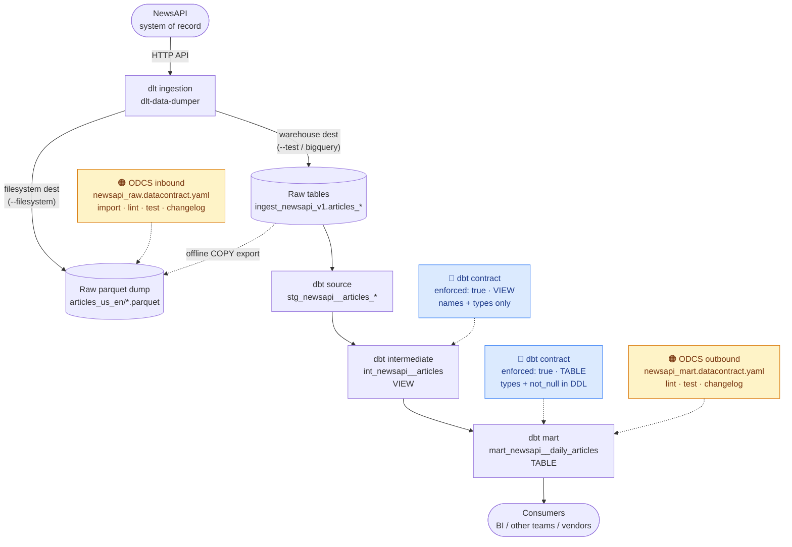

The one place both layers stack is the **mart**: dbt's contract guards how
it's *built*, and the ODCS contract is the artifact a non-dbt consumer can
point at, diff, and test on its own.

---

## The Two Contracts, Side by Side

They share the words "data contract" and nothing else. The quickest way to
keep them straight:

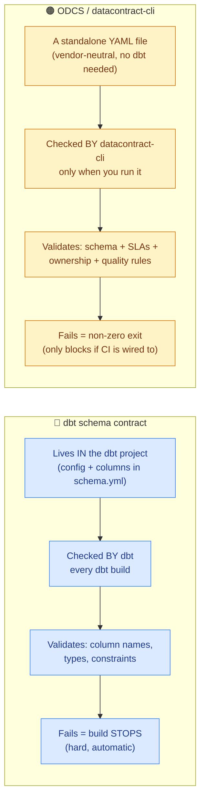

| | 🔵 dbt schema contract | 🟠 ODCS contract |
|---|---|---|
| **Scope** | Internal pipeline dependencies | Anyone outside the pipeline |
| **Runs** | Automatically, every build | Only when you invoke the CLI |
| **Portable?** | No — dbt-only | Yes — hand the file to anyone |
| **Failure** | Build errors, model never created | Non-zero exit; blocks only if CI enforces |
| **Extras** | Constraints, model versions | SLAs, ownership, custom SQL quality checks, 25+ export targets |

---

## How the Schema Evolves Down the Pipeline

The vendor's nested JSON is flattened by dlt, reshaped by the intermediate
model, then collapsed to a daily aggregate. Each stage's *contract* covers a
different shape:

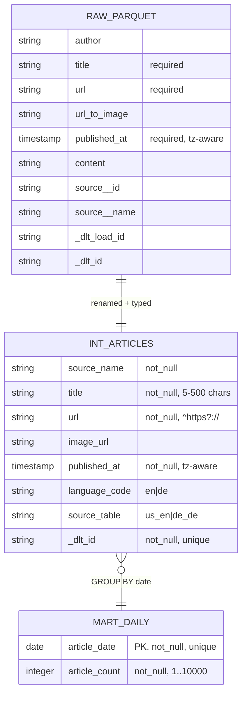

The same columns, three shapes — as a lineage table (⟶ = renamed, ✂ =
dropped, ✚ = derived):

| Raw parquet (inbound ODCS) | ⟶ | int_newsapi__articles (🔵 dbt view) | ⟶ | mart (🔵 dbt table + 🟠 ODCS) |
|---|---|---|---|---|
| `source__name` | ⟶ | `source_name` | ✂ | — |
| `url_to_image` | ⟶ | `image_url` | ✂ | — |
| `published_at` *(tz-aware)* | ⟶ | `published_at` *(tz-aware)* | ✚ | `article_date` *(DATE)* |
| *(one row per article)* | | *(one row per article)* | ✚ | `article_count` *(COUNT\*)* |
| `title, url, author, …` | ⟶ | `+ language_code, source_table` | ✂ | — |

> 📌 **Two type facts that bite here** (both are real breaks that happened in
> this repo): `published_at` is **timestamp *with time zone*** all the way
> down — declaring plain `timestamp` fails the dbt contract. And
> `article_count = CAST(COUNT(*) AS INTEGER)` — without the cast, DuckDB's
> `COUNT(*)` is `BIGINT` and the contract rejects it. See
> [Schema Change #2](#schema-change-2-internal-type-drift).

---

## The datacontract-cli Lifecycle

From an empty repo to a tested, diffable, exportable contract — the commands
in the order you actually run them:

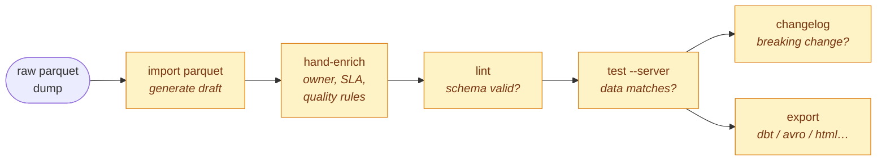

| Step | Command (via `make` or `uv run`) | Produces |
|---|---|---|
| **import** | `datacontract import parquet --source …` | a draft ODCS YAML from a real file |
| **lint** | `make data-contract-raw-lint` | 🟢 syntactically valid |
| **test** | `make data-contract-raw-test` / `-native` | 🟢 27 checks vs live data |
| **changelog** | `datacontract changelog v1 v2` | added/updated/removed table |
| **export** | `datacontract export dbt-models …` | dbt YAML, Avro, JSON Schema, HTML, … |

A passing live test looks like this (real output, `local_raw_native` server
over the parquet the dlt `filesystem` destination just landed):

```
🟢 data contract is valid. Run 27 checks. Took 0.89s.
```

---

## System of Record: Contracting Before the Platform

*(Theoretical extension — validated live against NewsAPI, but not wired into
the repo. See [`GETTING_STARTED_DATA_CONTRACTS.md` Part 2b](GETTING_STARTED_DATA_CONTRACTS.md#part-2b-contracting-the-system-of-record-directly-via-api-no-data-platform).)*

Every contract in this repo sits *after* a platform (dlt/dbt) has landed the
data. Can we go one stage further left and contract the **system of record**
— the vendor API — with no platform in between? Yes for the schema and the
test, but the CLI never calls the API for you. **datacontract-cli has no
`api`/`http`/`rest` server type** — its `test` engine reaches only the boxes
below:

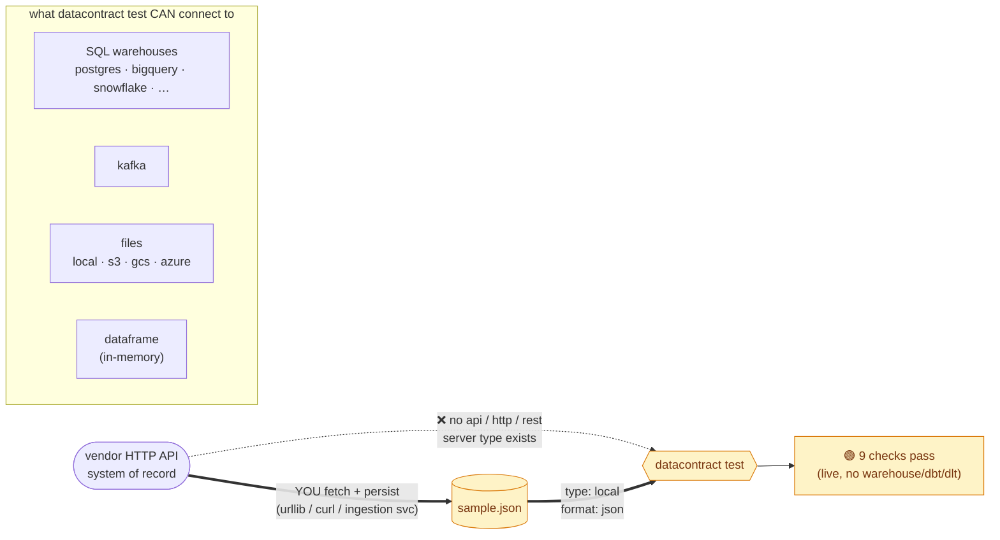

**The move:** `import json` learns the schema from one API record; `test`
reads the fetched array as a `type: local, format: json` server. What you
capture is the vendor's **native shape** — which is *not* what any downstream
contract sees:

| System-of-record contract (pre-platform) | Raw-parquet contract (post-dlt, [Part 2a](GETTING_STARTED_DATA_CONTRACTS.md#part-2a-inbound-contracts-on-raw-parquet-dumps)) |
|---|---|
| `publishedAt` *(camelCase)* | `published_at` *(snake_case)* |
| `urlToImage` | `url_to_image` |
| `source` *(nested object `{id,name}`)* | `source__id`, `source__name` *(flattened)* |
| — | `_dlt_load_id`, `_dlt_id` *(dlt bookkeeping)* |
| `type: local, format: **json**` | `type: local, format: **parquet**` |

Everything in the right column is **dlt's doing** — proof that the two
contracts describe genuinely different stages. Running both localises blame:

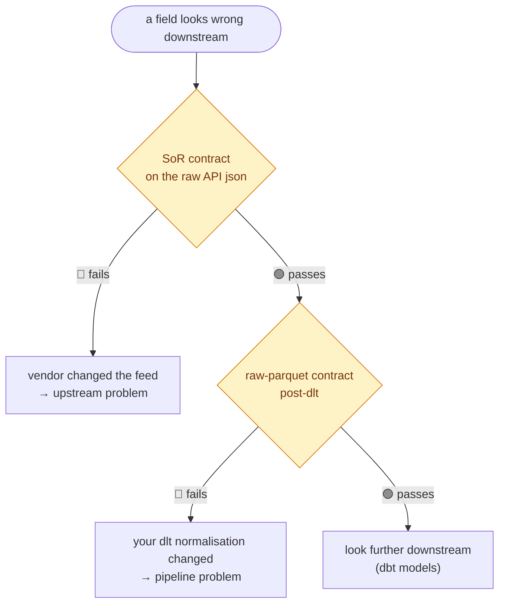

**Why bother:** shift-left (catch vendor drift at the edge, in the vendor's
own terms), zero platform dependency (runs in the ingestion service / a
lambda), and the blame-triage above. **The catch:** you own the
fetch-and-persist step (the CLI won't poll the API), and `import json` needs a
*single-object* sample to infer fields — a bare array imports only an empty
`array` wrapper.

---

## Schema Change #1: the vendor changes the raw feed

The **inbound** story. The vendor drops `content`, retypes `published_at`,
and adds a `sentiment` column. You edit the contract to describe the new
reality and diff it — no dbt run involved, because a downstream BI consumer
who never touches dbt needs to see this too.

```diff
  schema:
  - name: raw_newsapi__articles_us_en
    properties:
    - name: published_at
-     physicalType: TIMESTAMP
+     physicalType: STRING
+   - name: sentiment
+     physicalType: STRING
-   - name: content
-     physicalType: STRING
```

`datacontract changelog v1.yaml v2.yaml` turns that into a
consumer-facing summary (real output):

```
Summary
[ 1 Added ]  [ 1 Updated ]  [ 1 Removed ]
╭─────────┬────────────────────────────────────────────────────────────╮
│ Change  │ Field                                                      │
├─────────┼────────────────────────────────────────────────────────────┤
│ Removed │ schema.raw_newsapi__articles_us_en.properties.content      │
│ Updated │ schema.raw_newsapi__articles_us_en.properties.published_at │
│ Added   │ schema.raw_newsapi__articles_us_en.properties.sentiment    │
╰─────────┴────────────────────────────────────────────────────────────╯
```

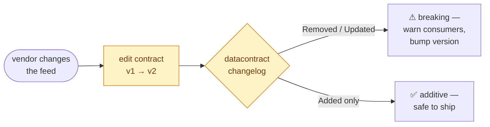

Key point: this catches vendor-side drift **before** dbt even runs, and it
speaks to consumers who never run dbt at all.

---

## Schema Change #2: internal type drift

The **internal** story, and where dbt's contract is unbeatable. Someone
"simplifies" the mart SQL by dropping a cast:

```diff
  WITH daily_articles AS (
      SELECT
          CAST(published_at AS DATE) AS article_date,
-         CAST(COUNT(*) AS INTEGER) AS article_count
+         COUNT(*) AS article_count
      FROM {{ ref('int_newsapi__articles') }}
```

`COUNT(*)` is `BIGINT` in DuckDB, but the contract promises `INTEGER`. The
build **stops** — the bad model is never created (real output):

```
Compilation Error in model mart_newsapi__daily_articles
This model has an enforced contract that failed.
Please ensure the name, data_type, and number of columns in your contract
match the columns in your model's definition.

| column_name   | definition_type | contract_type | mismatch_reason    |
| ------------- | --------------- | ------------- | ------------------ |
| article_count | BIGINT          | INTEGER       | data type mismatch |
```

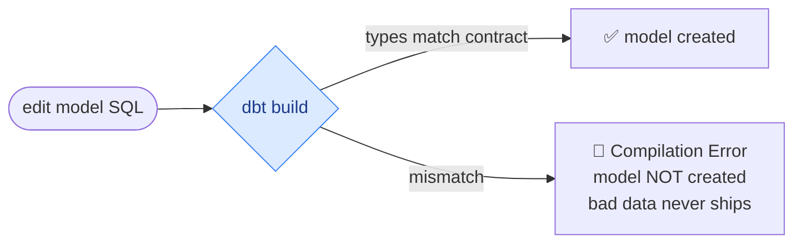

No CI step to remember, no separate command — the guarantee is welded into
`dbt build` itself.

**The two changes, and who catches them:**

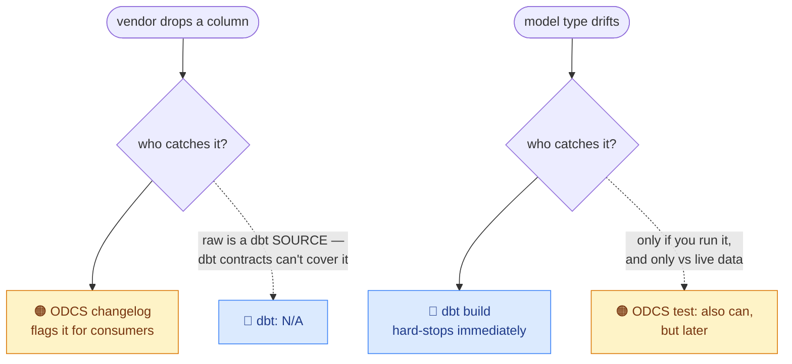

---

## Where dbt Schema Contracts Shine

The ODCS layer is broader (SLAs, ownership, portability), but for the
*internal* pipeline dbt contracts have capabilities the ODCS file doesn't
replace:

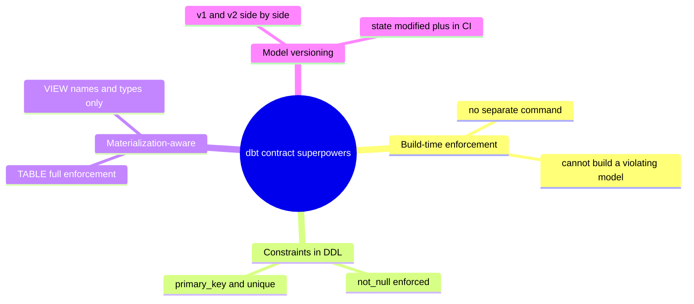

**1 · Constraint enforcement depends on materialization *and* platform.**
A contract that passes locally can behave differently in prod:

| | `not_null` | `primary_key` | `unique` | `check` |
|---|:---:|:---:|:---:|:---:|
| **DuckDB (dev)** | ✅ enforced | definable | ✅ enforced | ❌ |
| **BigQuery (prod)** | ✅ enforced | definable, not enforced | ❌ | ❌ |

So `int_newsapi__articles` (a **VIEW**) only gets name/type checks, while
`mart_newsapi__daily_articles` (a **TABLE**) gets `not_null` welded into its
DDL — and a `unique` that passes on DuckDB won't block a duplicate on
BigQuery. The ODCS layer fills that gap with its own quality checks.

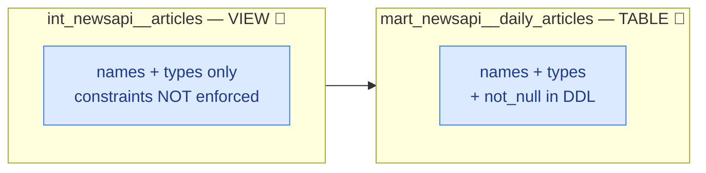

**2 · The round-trip is lossy — dbt stays the source of truth for types.**
`datacontract export dbt-models` is handy but generalises types; don't paste
it blindly over a hand-tuned contract:

```diff
  # mart article_count, as exported by datacontract-cli:
- data_type: NUMBER        # generic — what the exporter emits
+ data_type: integer       # what the dbt contract actually enforces
```

(The raw contract's `published_at` similarly round-trips as `TIMESTAMP_TZ`,
not the `timestamp with time zone` dbt wants.) Treat the export as a
starting point or a consistency check — never as authoritative.

**3 · Model versions** let two shapes of the same model coexist during a
migration (`versions:` + `latest_version` in `schema.yml`), with
`dbt build --select state:modified+` flagging breaking changes in CI — the
internal-pipeline analogue of `datacontract changelog`.

---

## Putting It Together: One CI Pipeline, Two Gates

Walk the pipeline front to back so a break is caught at the earliest stage it
appears:

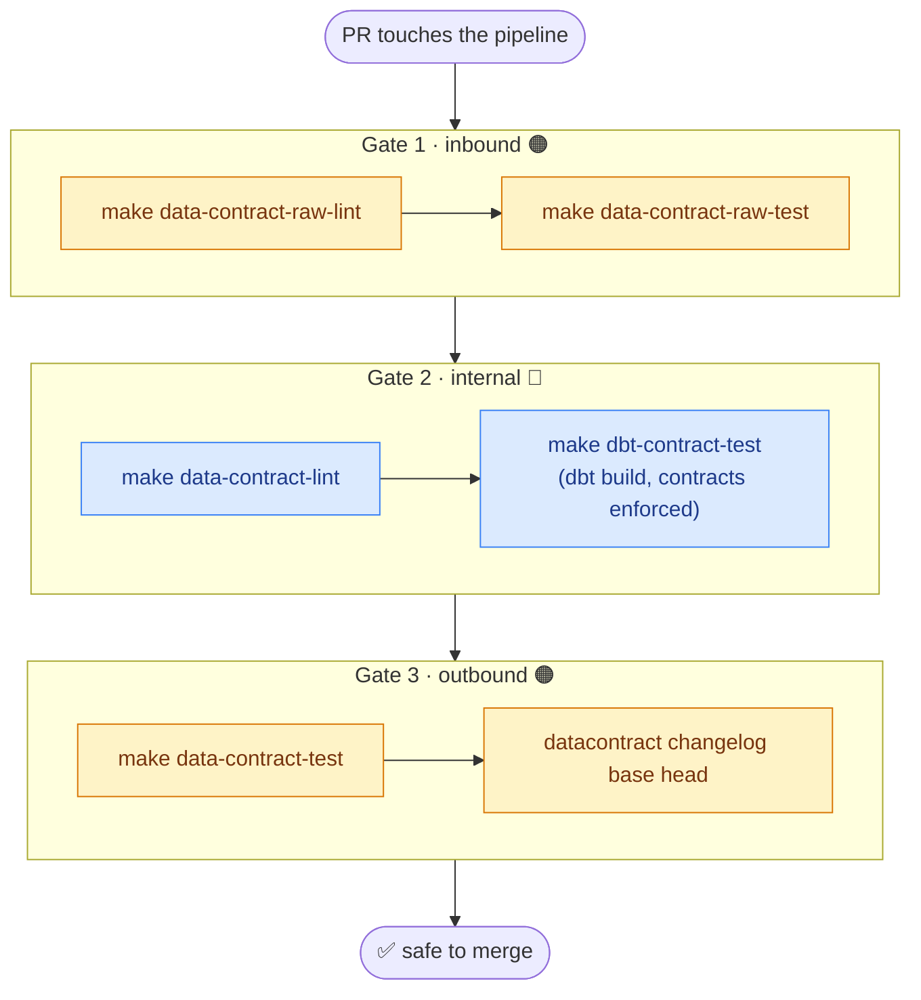

Each gate answers a different question: **Gate 1** — did the vendor feed
change shape? **Gate 2** — do the internal models still honour their promised
schema? **Gate 3** — does the published mart still match what consumers
depend on, and if it changed, is the change breaking?

---

## Command Cheat-Sheet

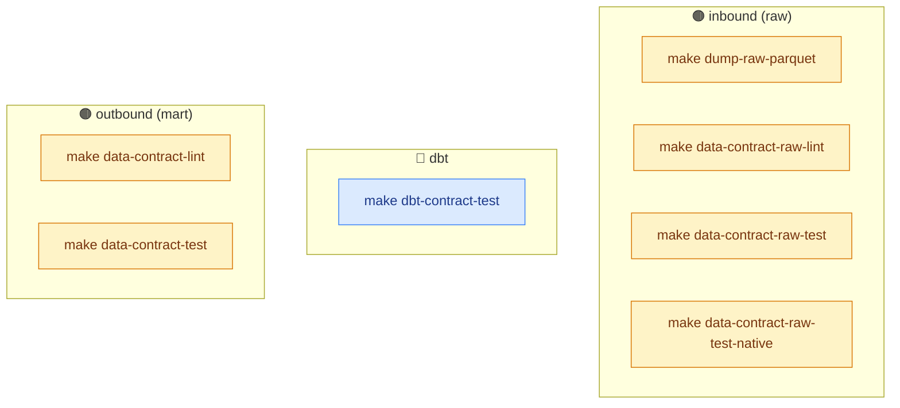

| Make target | Layer | What it does |
|---|---|---|
| `dump-raw-parquet` | 🟠 in | live NewsAPI fetch → native parquet (dlt filesystem dest) |
| `data-contract-raw-lint` | 🟠 in | lint the inbound contract |
| `data-contract-raw-test` | 🟠 in | test contract vs offline duckdb export |
| `data-contract-raw-test-native` | 🟠 in | test contract vs native dlt parquet glob |
| `dbt-contract-test` | 🔵 | `dbt build` with contracts enforced |
| `data-contract-lint` | 🟠 out | lint the mart contract |
| `data-contract-test` | 🟠 out | test mart contract vs exported parquet |

For the *why* behind any of these — the DuckDB-vs-BigQuery constraint
matrix, the `type: duckdb` test limitation, the `dbt sync` gotchas, the
`numeric` precision trap — see
[`GETTING_STARTED_DATA_CONTRACTS.md`](GETTING_STARTED_DATA_CONTRACTS.md).

---

## Validation

Every figure above is derived from a command actually run against this repo
(dbt-core 1.11.12, datacontract-cli 1.0.12, dlt 1.28.1), not sketched:

- **Schemas** (Big Picture, evolution, erDiagram) — the raw columns/types
  are the live parquet the dlt `filesystem` destination landed
  (`make dump-raw-parquet`); the intermediate/mart columns are the actual
  `contract.enforced: true` model YAMLs (`int_newsapi__articles.yml`,
  `mart_newsapi__daily_articles.yml`).
- **Schema Change #1** — the changelog table is verbatim output of
  `datacontract changelog` on a real edited copy of
  `newsapi_raw.datacontract.yaml` (retype `published_at`, add `sentiment`,
  drop `content`).
- **Schema Change #2** — the `Compilation Error` block is verbatim from
  `make dbt-contract-test` after removing the `CAST(... AS INTEGER)`; the SQL
  was restored and the build re-run green (`PASS=31 WARN=0 ERROR=0`)
  immediately after.
- **Lint/test outputs** — `make data-contract-raw-lint` (1 check),
  `-raw-test` / `-raw-test-native` (27 checks), `data-contract-test`
  (9 checks) all pass 🟢; the `NUMBER` / `TIMESTAMP_TZ` export quirks are
  real `datacontract export dbt-models` output.
- **System of Record section** — validated **live** against the real NewsAPI:
  fetched 20 records directly from `newsapi.org/v2/everything`,
  `datacontract import json` from a single record produced the camelCase /
  nested-`source` schema shown, and `datacontract test --server production`
  (`type: local, format: json`) passed **9 checks** on the fetched array. The
  "no `api`/`http`/`rest` server type" claim was confirmed both in the
  installed source (`connect.py`) and the official
  [datacontract-cli README](https://github.com/datacontract/datacontract-cli).
- **Mermaid** — every diagram (flowchart / erDiagram / mindmap) was parsed
  headlessly with the real `mermaid` library; all pass. All internal anchor
  links resolve to headers in this file.

Re-run the full set anytime with the [cheat-sheet](#command-cheat-sheet)
targets; if a future `datacontract-cli` release changes any output, re-verify
rather than trusting the snapshot here.
